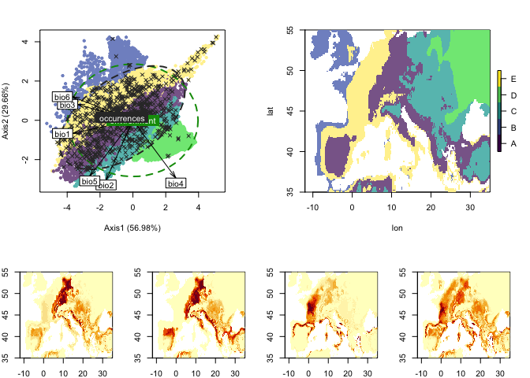
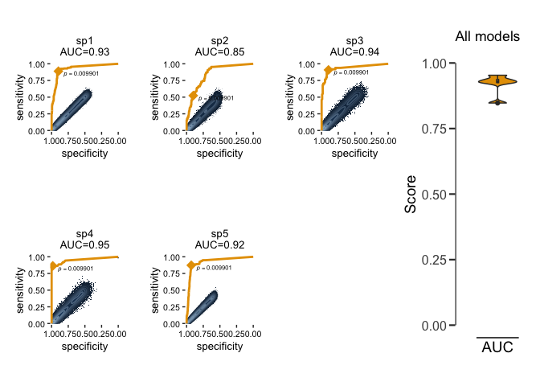

<!-- README.md is generated from README.Rmd. Please edit that file -->

# NINA package

<!-- badges: start -->

[](https://travis-ci.com/agarciaEE/NINA)
[](https://ci.appveyor.com/project/agarciaEE/NINA)
[](https://codecov.io/gh/agarciaEE/NINA?branch=main)
[](https://CRAN.R-project.org/package=NINA)
<!-- badges: end -->

The goal of NINA is the the analysis and implementation of biotic
interactions into environmental niche models using kernel density
estimations.

## Installation

You can install NINA from github repository with:

``` r
devtools::install_github("agarciaEE/NINA")
```

## Example

This is a basic example which shows you how to use NINA’s functions:

``` r
library(NINA)
#> Registered S3 methods overwritten by 'adehabitatMA':
#>   method                       from
#>   print.SpatialPixelsDataFrame sp  
#>   print.SpatialPixels          sp
```

Estimate Environmental Niche Models:

First group of species

``` r
g1_EN = EN_model(env_data, occ_data1, cluster = "env", n.clus = 5)
#> Carrying out unique EN model...
#> Occurrence dataset ... OK
#> Environmental dataset ... OK
#>  - Conforming environmental space...
#>  - Clustering environmental variables...
#>  - Regions:
#> [1] "A" "B" "C" "D" "E"
#>  - Carrying out species EN models in region A...
#>      - Modelling spA Environmental Niche...
#>      - Estimating spA niche response in region A...
#>      - Modelling spB Environmental Niche...
#>      - Estimating spB niche response in region A...
#>      - Modelling spC Environmental Niche...
#>      - Estimating spC niche response in region A...
#>      - Modelling spD Environmental Niche...
#>      - Estimating spD niche response in region A...
#>      - Modelling spE Environmental Niche...
#>      - Estimating spE niche response in region A...
#>  - Carrying out species EN models in region B...
#>      - Modelling spA Environmental Niche...
#>      - Estimating spA niche response in region B...
#>      - Modelling spB Environmental Niche...
#>      - Estimating spB niche response in region B...
#>      - Modelling spC Environmental Niche...
#>      - Estimating spC niche response in region B...
#>      - Modelling spD Environmental Niche...
#>      - Estimating spD niche response in region B...
#>      - Modelling spE Environmental Niche...
#>      - Estimating spE niche response in region B...
#>  - Carrying out species EN models in region C...
#>      - Modelling spA Environmental Niche...
#>      - Estimating spA niche response in region C...
#>      - Modelling spB Environmental Niche...
#>      - Estimating spB niche response in region C...
#>      - Modelling spC Environmental Niche...
#>      - Estimating spC niche response in region C...
#>      - Modelling spD Environmental Niche...
#>      - Estimating spD niche response in region C...
#>      - Modelling spE Environmental Niche...
#> Warning in EN_model_(env, occ, res = res, nstart = nstart, k.max = k.max, : Not
#> enough observations of spE in region C.
#>  - Carrying out species EN models in region D...
#>      - Modelling spA Environmental Niche...
#> Warning in EN_model_(env, occ, res = res, nstart = nstart, k.max = k.max, : Not
#> enough observations of spA in region D.
#>      - Modelling spB Environmental Niche...
#>      - Estimating spB niche response in region D...
#>      - Modelling spC Environmental Niche...
#>      - Estimating spC niche response in region D...
#>      - Modelling spD Environmental Niche...
#>      - Estimating spD niche response in region D...
#>      - Modelling spE Environmental Niche...
#> Warning in EN_model_(env, occ, res = res, nstart = nstart, k.max = k.max, : Not
#> enough observations of spE in region D.
#>  - Carrying out species EN models in region E...
#>      - Modelling spA Environmental Niche...
#>      - Estimating spA niche response in region E...
#>      - Modelling spB Environmental Niche...
#> Warning in EN_model_(env, occ, res = res, nstart = nstart, k.max = k.max, : Not
#> enough observations of spB in region E.
#>      - Modelling spC Environmental Niche...
#> Warning in EN_model_(env, occ, res = res, nstart = nstart, k.max = k.max, : Not
#> enough observations of spC in region E.
#>      - Modelling spD Environmental Niche...
#>      - Estimating spD niche response in region E...
#> Warning in EN_model_(env, occ, res = res, nstart = nstart, k.max = k.max, :
#> Model failed to predict the following species due to lack of observations
#>   region species
#> 1      C     spE
#> 2      D     spA
#> 3      D     spE
...
#> Species EN models succesfully completed!
```

2nd group of species

``` r
g2_EN = EN_model(env_data, occ_data2, cluster = g1_EN$clus)
#> Carrying out unique EN model...
#> Occurrence dataset ... OK
#> Environmental dataset ... OK
#>  - Conforming environmental space...
#>  - Clustering based on provided regions...
#>  - Regions:
#> [1] "A" "B" "C" "D" "E"
#>  - Carrying out species EN models in region A...
#>      - Modelling sp1 Environmental Niche...
#>      - Estimating sp1 niche response in region A...
#>      - Modelling sp2 Environmental Niche...
#>      - Estimating sp2 niche response in region A...
#>      - Modelling sp3 Environmental Niche...
#>      - Estimating sp3 niche response in region A...
#>      - Modelling sp4 Environmental Niche...
#>      - Estimating sp4 niche response in region A...
#>      - Modelling sp5 Environmental Niche...
#> Warning in EN_model_(env, occ, res = res, nstart = nstart, k.max = k.max, : Not
#> enough observations of sp5 in region A.
#>  - Carrying out species EN models in region B...
#>      - Modelling sp1 Environmental Niche...
#>      - Estimating sp1 niche response in region B...
#>      - Modelling sp2 Environmental Niche...
#>      - Estimating sp2 niche response in region B...
#>      - Modelling sp3 Environmental Niche...
#>      - Estimating sp3 niche response in region B...
#>      - Modelling sp4 Environmental Niche...
#>      - Estimating sp4 niche response in region B...
#>      - Modelling sp5 Environmental Niche...
#>      - Estimating sp5 niche response in region B...
#>  - Carrying out species EN models in region C...
#>      - Modelling sp1 Environmental Niche...
#>      - Estimating sp1 niche response in region C...
#>      - Modelling sp2 Environmental Niche...
#> Warning in EN_model_(env, occ, res = res, nstart = nstart, k.max = k.max, : Not
#> enough observations of sp2 in region C.
#>      - Modelling sp3 Environmental Niche...
#>      - Estimating sp3 niche response in region C...
#>      - Modelling sp4 Environmental Niche...
#>      - Estimating sp4 niche response in region C...
#>      - Modelling sp5 Environmental Niche...
#>      - Estimating sp5 niche response in region C...
#>  - Carrying out species EN models in region D...
#>      - Modelling sp1 Environmental Niche...
#> Warning in EN_model_(env, occ, res = res, nstart = nstart, k.max = k.max, : Not
#> enough observations of sp1 in region D.
#>      - Modelling sp3 Environmental Niche...
#>      - Estimating sp3 niche response in region D...
#>      - Modelling sp4 Environmental Niche...
#> Warning in EN_model_(env, occ, res = res, nstart = nstart, k.max = k.max, : Not
#> enough observations of sp4 in region D.
#>  - Carrying out species EN models in region E...
#>      - Modelling sp1 Environmental Niche...
#> Warning in EN_model_(env, occ, res = res, nstart = nstart, k.max = k.max, : Not
#> enough observations of sp1 in region E.
#>      - Modelling sp3 Environmental Niche...
#>      - Estimating sp3 niche response in region E...
#>      - Modelling sp4 Environmental Niche...
#>      - Estimating sp4 niche response in region E...
#>      - Modelling sp5 Environmental Niche...
#>      - Estimating sp5 niche response in region E...
#> Warning in EN_model_(env, occ, res = res, nstart = nstart, k.max = k.max, :
#> Model failed to predict the following species due to lack of observations
#>   region species
#> 1      A     sp5
#> 2      C     sp2
#> 3      D     sp1
...
#> Species EN models succesfully completed!
```

Correct EN models by biotic interactions:

``` r
g2_BC <- BC_model(g2_EN, g1_EN, A.matrix = int_matrix, type = "region")
#> Estimating biotic constrains of species in region A...
#>  Adding biotic constrains to sp1...  ...Success!
#>  Adding biotic constrains to sp2...  ...Success!
#>  Adding biotic constrains to sp3...  ...Success!
#>  Adding biotic constrains to sp4...  ...Success!
#> Estimating biotic constrains of species in region B...
#>  Adding biotic constrains to sp1...  ...Success!
#>  Adding biotic constrains to sp2...  ...Success!
#>  Adding biotic constrains to sp3...  ...Success!
#>  Adding biotic constrains to sp4...  ...Success!
#>  Adding biotic constrains to sp5...  ...Success!
#> Estimating biotic constrains of species in region C...
#>  Adding biotic constrains to sp1...  ...Success!
#>  Adding biotic constrains to sp3...  ...Success!
#>  Adding biotic constrains to sp4...  ...Success!
#>  Adding biotic constrains to sp5...  ...Success!
#> Estimating biotic constrains of species in region D...
#>  Adding biotic constrains to sp3...  ...Success!
#> Estimating biotic constrains of species in region E...
#>  Adding biotic constrains to sp3...  ...Success!
#>  Adding biotic constrains to sp4...  ...Success!
#>  Adding biotic constrains to sp5...  ...Success!
#>  - Carrying out models evaluations...
#> Observations ... OK
#> Environmental predictors ... OK
#> Model predictions ... OK
#> Sampling pseudo_absences... 
#> Performing models evaluation...
#>  ...Evaluating sp1 niche model...
#>  ...Evaluating sp2 niche model...
#>  ...Evaluating sp3 niche model...
#>  ...Evaluating sp4 niche model...
#>  ...Evaluating sp5 niche model...
#> Models evaluation performed.
#> Models successfully corrected!
```

Transform environmental niche space into ecological niche space
(prioritizing the effect of biotic interactions).

``` r
g2_EC <- EC_model(g2_BC, type = "region")
#> Transforming niche space of species in region A...
#>  Estimating ecological niche of sp1...   ...Success!
#>  Estimating ecological niche of sp2...   ...Success!
#>  Estimating ecological niche of sp3...   ...Success!
#>  Estimating ecological niche of sp4...   ...Success!
#> Transforming niche space of species in region B...
#>  Estimating ecological niche of sp1...   ...Success!
#>  Estimating ecological niche of sp2...   ...Success!
#>  Estimating ecological niche of sp3...   ...Success!
#>  Estimating ecological niche of sp4...   ...Success!
#>  Estimating ecological niche of sp5...   ...Success!
#> Transforming niche space of species in region C...
#>  Estimating ecological niche of sp1...   ...Success!
#>  Estimating ecological niche of sp3...   ...Success!
#>  Estimating ecological niche of sp4...   ...Success!
#>  Estimating ecological niche of sp5...   ...Success!
#> Transforming niche space of species in region D...
#>  Estimating ecological niche of sp3...   ...Success!
#> Transforming niche space of species in region E...
#>  Estimating ecological niche of sp3...   ...Success!
#>  Estimating ecological niche of sp4...   ...Success!
#> Models successfully transformed!
```

You can summarize the output by using `summary` function or `print`:

``` r
summary(g1_EN)
#> Niche model type:
#> Environmental-only
#> Predictors:
#> bio1 bio2 bio3 bio4 bio5 bio6
#> 2 axis-components used
#> Class: pca dudi
#> Call: dudi.pca(df = stats::na.exclude(env[, env.var]), center = T, 
#>     scale = T, scannf = F, nf = 2)
...
#> TRUE
#> Geographical extents:
#> 5
#>   spA spB spC spD spE
#> A   1   1   1   1   1
#> B   1   1   1   1   1
#> C   1   1   1   1   0
...
#> FALSE
#> Failures or warnings:
#> TRUE
#>   region species
#> 1      C     spE
#> 2      D     spA
#> 3      D     spE
...
#> FALSE
print(g2_BC)
#> Object class: NINA
#> 
#> Niche model type:
#> Environmental-constrained
#> Predictors:
#> bio1 bio2 bio3 bio4 bio5 bio6
#> Spatially constrained:
#> TRUE
#> Geographical extents:
#> 5
#> Ensemble of regional models:
#> FALSE
#> Number of species:
#> 5
#> Failures or warnings:
#> TRUE
#> Models evaluation:
#> TRUE
```

You can also plot a summary of the output model using `plot` function:

``` r
plot(g2_BC)
#> Ploting only the first four species maps of a total of 5
```



Models can be evaluated using `models_evaluation` function and visualize
it by plotting the output.

``` r
eval <- models_evaluation(g2_BC)
#> Observations ... OK
#> Environmental predictors ... OK
#> Model predictions ... OK
#> Sampling pseudo_absences...
#> Performing models evaluation...
#>  ...Evaluating sp1 niche model...
#>  ...Evaluating sp2 niche model...
#>  ...Evaluating sp3 niche model...
#>  ...Evaluating sp4 niche model...
#>  ...Evaluating sp5 niche model...
#> Models evaluation performed.
plot(eval)
```


